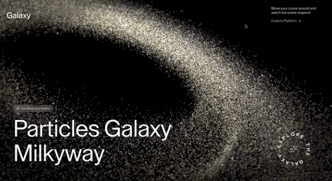
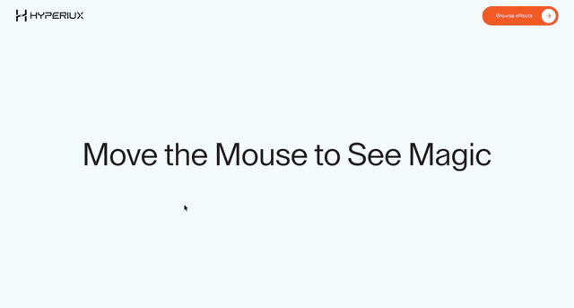
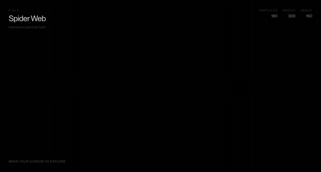
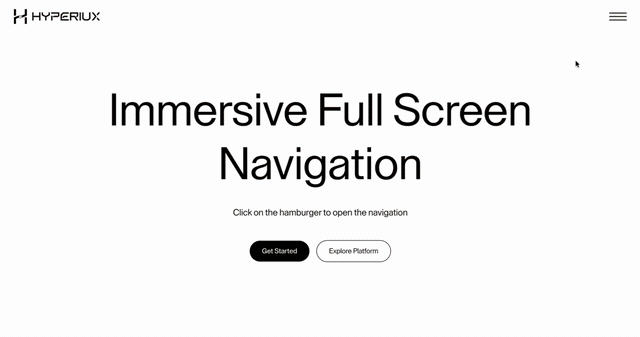

# Hyperiux Vault

[](https://www.npmjs.com/package/hyperiux)
[](https://www.npmjs.com/package/hyperiux)

[](LICENSE)

**A collection of high-quality animation effects and interactive components for Next.js - designed by [Hyperiux](https://hyperiux.com).**

32 free effects are open source and install instantly. 83 pro effects are available with a [Pro subscription](https://vault.hyperiux.com/pricing). The CLI copies source code directly into your project - you own what you install.

<table>
<tr>
<td width="50%">

**[Milky Way](https://vault.hyperiux.com/effects/webgl/milky-way)** - WebGL particle field
<br />


</td>
<td width="50%">

**[Phantom Image Trail](https://vault.hyperiux.com/effects/cursor/phantom-image-trail)** - Cursor-following image trail
<br />


</td>
</tr>
<tr>
<td width="50%">

**[Spider Particles](https://vault.hyperiux.com/effects/backgrounds/spider-particles)** - Interactive particle field background
<br />


</td>
<td width="50%">

**[Immersive Full-Screen Nav](https://vault.hyperiux.com/effects/navigation/immersive-full-screen-nav)** - Full-screen navigation overlay
<br />


</td>
</tr>
</table>

All four are free - `npx hyperiux add <effect-name>` installs any of them. Browse the rest at [vault.hyperiux.com/effects](https://vault.hyperiux.com/effects).

---

## Quick Start

### 1. Initialize your project

```bash
npx hyperiux init
```

This creates a `hyperiux.json` config at your project root that tells the CLI where to install files and how your project is structured.

### 2. Add a free effect

```bash
npx hyperiux add phantom-image-trail
```

### 3. Use it

```jsx
import PhantomImageTrail from "@/components/effects/phantom-image-trail";

export default function Page() {
  const images = [
    { src: "https://pub-8abee449136941f5b0a1cd2c014534e9.r2.dev/vault-listing-images/assets-images/h-11.jpg", alt: "Gradient 1" },
    { src: "https://pub-8abee449136941f5b0a1cd2c014534e9.r2.dev/vault-listing-images/assets-images/h-12.jpg", alt: "Gradient 2" },
    { src: "https://pub-8abee449136941f5b0a1cd2c014534e9.r2.dev/vault-listing-images/assets-images/h-13.jpg", alt: "Gradient 3" },
    { src: "https://pub-8abee449136941f5b0a1cd2c014534e9.r2.dev/vault-listing-images/assets-images/h-14.jpg", alt: "Gradient 4" },
    { src: "https://pub-8abee449136941f5b0a1cd2c014534e9.r2.dev/vault-listing-images/assets-images/h-15.jpg", alt: "Gradient 5" },
    { src: "https://pub-8abee449136941f5b0a1cd2c014534e9.r2.dev/vault-listing-images/assets-images/h-01.jpg", alt: "Gradient 6" },
    { src: "https://pub-8abee449136941f5b0a1cd2c014534e9.r2.dev/vault-listing-images/assets-images/h-02.jpg", alt: "Gradient 7" },
  ];
  return (
    <div className="relative h-screen w-screen bg-[#f8fdfe]">
      <PhantomImageTrail
        images={images}
        enableRotation={true}
        idleSpawn={false}
        idleDelay={300}
        cursorOffsetX={-12}
        cursorOffsetY={-12}
        popOutDuration={0.8}
        fadeOutDuration={0.5}
        idlePopOutMultiplier={2.2}
        idleFadeMultiplier={1.8}
        imageMultiplier={3}
      />
    </div>
  );
}
```

**Props**

| Prop | Type | Default | Description |
|---|---|---|---|
| `images` | `Array<{ src: string; alt?: string }> \| string[]` | default image set | Image list to cycle through |
| `className` | `string` | `""` | Class applied to the outer wrapper |
| `imageClassName` | `string` | `""` | Extra classes applied to each image |
| `imageMultiplier` | `number` | `3` | Multiplies the image set to extend the trail |
| `enableRotation` | `boolean` | `true` | Enables randomized rotation on spawn and exit |
| `minStartRotation` | `number` | `-35` | Minimum starting rotation in degrees |
| `maxStartRotation` | `number` | `35` | Maximum starting rotation in degrees |
| `minExitRotation` | `number` | `-15` | Minimum exit rotation in degrees |
| `maxExitRotation` | `number` | `15` | Maximum exit rotation in degrees |
| `idleSpawn` | `boolean` | `true` | Enables idle image spawns while the pointer rests |
| `idleDelay` | `number` | `300` | Idle spawn delay in milliseconds |
| `idleDistanceThreshold` | `number` | `2` | Pointer movement threshold for idle spawning |
| `triggerDistance` | `number` | `100` | Pointer movement distance required to trigger a new image |
| `cursorOffsetX` | `number` | `-12` | Horizontal offset applied from the cursor |
| `cursorOffsetY` | `number` | `-12` | Vertical offset applied from the cursor |
| `popOutDuration` | `number` | `1` | Duration of the main pop-out animation in seconds |
| `fadeOutDuration` | `number` | `0.7` | Duration of the fade-out animation in seconds |
| `idlePopOutMultiplier` | `number` | `1.8` | Multiplier applied to pop-out duration for idle spawns |
| `idleFadeMultiplier` | `number` | `1.5` | Multiplier applied to fade duration for idle spawns |
| `startScale` | `number` | `0.2` | Initial scale when an image appears |
| `endScale` | `number` | `1` | Scale during the main pop-out animation |
| `exitScale` | `number` | `0` | Scale at the end of the fade-out animation |
| `smoothMouse` | `boolean` | `true` | Smooths pointer movement before spawning images |
| `lerpFactor` | `number` | `0.1` | Smoothing factor used when `smoothMouse` is enabled |
| `disableOnMobile` | `boolean` | `false` | Disables cursor-driven spawning on coarse pointers |
| `enableMobileTap` | `boolean` | `true` | Allows taps to spawn images on mobile devices |
| `popEase` | `string \| function` | `Expo.easeOut` | Easing used for the pop-out animation |
| `idlePopEase` | `string \| function` | `power1.out` | Easing used for idle pop-out animations |
| `fadeEase` | `string \| function` | `power4.inOut` | Easing used for the fade-out animation |
| `onImageShow` | `(payload) => void` | - | Callback fired when an image is shown |

---

## CLI Commands

| Command | Description |
|---|---|
| `npx hyperiux init` | Initialize config in your project |
| `npx hyperiux add <effect>` | Add an effect to your project |
| `npx hyperiux list` | List all available effects |
| `npx hyperiux login` | Connect your Pro account |
| `npx hyperiux logout` | Remove saved credentials |
| `npx hyperiux whoami` | Show current login status |

### Options for `add`

| Flag | Description |
|---|---|
| `--overwrite` | Replace existing files. **Required** to overwrite anything already on disk — nothing is overwritten without it |
| `--yes` | Skip interactive prompts. This does **not** permit overwriting: if files already exist and `--overwrite` was not passed, they are left untouched and the effect is skipped |
| `--dry-run` | Preview what would be installed without writing files |

> **Note:** `--yes` only skips prompts; it never grants permission to overwrite. To replace a file you have already installed (and possibly customized), pass `--overwrite` explicitly. Run `npx hyperiux diff <effect>` first to preview exactly what would change.

---

## Free Effects

All 32 free effects install without an account. Browse and preview them at [vault.hyperiux.com/effects](https://vault.hyperiux.com/effects).

```bash
# Backgrounds
npx hyperiux add spider-particles
npx hyperiux add dotted-grid

# Buttons
npx hyperiux add arrow-fill-button
npx hyperiux add link-button
npx hyperiux add scramble-link-button

# Carousels
npx hyperiux add zoom-slider

# Components
npx hyperiux add animated-faq
npx hyperiux add gooey-counter
npx hyperiux add hover-stack
npx hyperiux add interactive-list-preview

# Cursor
npx hyperiux add phantom-image-trail
npx hyperiux add pixelated-image-effect

# Loaders
npx hyperiux add numeric-tunnel
npx hyperiux add stack-loader

# Navigation
npx hyperiux add directional-menu
npx hyperiux add elevate-navbar
npx hyperiux add immersive-full-screen-nav

# Scroll
npx hyperiux add circular-split-roll
npx hyperiux add horizontal-feature-reveal
npx hyperiux add infinite-perspective-slider
npx hyperiux add rotation-slider
npx hyperiux add split-canvas
npx hyperiux add sticky-content-wrapper
npx hyperiux add text-convergence

# Text
npx hyperiux add number-counter
npx hyperiux add overflow-stagger-text
npx hyperiux add rectangular-text-reveal

# Transitions
npx hyperiux add block-transition
npx hyperiux add chess-grid-transition

# WebGL
npx hyperiux add fractal-glass
npx hyperiux add interactive-blur-reveal
npx hyperiux add milky-way
```

### Free effects by category

**Backgrounds** - `spider-particles` · `dotted-grid`

**Buttons** - `arrow-fill-button` · `link-button` · `scramble-link-button`

**Carousels** - `zoom-slider`

**Components** - `animated-faq` · `gooey-counter` · `hover-stack` · `interactive-list-preview`

**Cursor** - `phantom-image-trail` · `pixelated-image-effect`

**Loaders** - `numeric-tunnel` · `stack-loader`

**Navigation** - `elevate-navbar` · `directional-menu`  · `immersive-full-screen-nav`

**Scroll** - `circular-split-roll` · `horizontal-feature-reveal` · `infinite-perspective-slider` · `rotation-slider` · `split-canvas` · `sticky-content-wrapper` · `text-convergence`

**Text** - `number-counter` · `overflow-stagger-text` · `rectangular-text-reveal`

**Transitions** - `block-transition` · `chess-grid-transition`

**WebGL** - `fractal-glass` · `interactive-blur-reveal` · `milky-way`

---

## Pro Effects

83 pro effects require a [Hyperiux Vault Pro subscription](https://vault.hyperiux.com/pricing). This covers WebGL shaders, advanced Three.js scenes, GPU particle systems, complex GSAP rigs, and everything else in the full vault.

### Getting started with Pro

**Step 1 - Get a Pro subscription**

Visit [vault.hyperiux.com/pricing](https://vault.hyperiux.com/pricing) and subscribe. Monthly and yearly plans are available.

**Step 2 - Generate a CLI token**

Go to your [dashboard](https://vault.hyperiux.com/dashboard) → **CLI Token** → copy the token.

**Step 3 - Authenticate the CLI**

```bash
npx hyperiux login
```

Paste your token when prompted. The CLI saves it locally so you only need to do this once per machine.

**Step 4 - Install pro effects the same way as free**

```bash
npx hyperiux add spotlight-text
npx hyperiux add square-translate
npx hyperiux add draggable-canvas
```

### Verify your login

```bash
npx hyperiux whoami
```

### CI / CD environments

If you install effects in a CI pipeline, set the token as an environment variable instead of running `login`:

```bash
HYPERIUX_TOKEN=your_token npx hyperiux add spotlight-text
```

Or add `HYPERIUX_TOKEN` to your CI secrets and the CLI will pick it up automatically.

### Browse Pro effects

All 83 pro effects with live previews, code previews, and installation names are listed at [vault.hyperiux.com/effects](https://vault.hyperiux.com/effects).

---

## How It Works

The CLI **copies source code** into your project. There is no `hyperiux` import at runtime - the installed files are yours and live in your repo. This means:

- No vendor lock-in
- Customize any component freely after installing
- Works with any Next.js App Router project

When you run `npx hyperiux add <effect>`, the CLI:

1. Fetches the component source from the registry
2. Installs it into `src/components/effects/<effect-name>/`
3. Installs any peer dependencies (`gsap`, `three`, etc.) via your package manager
4. Leaves the files in your codebase - no ongoing CLI dependency

---

## Configuration

`hyperiux.json` is created by `init` at your project root:

```json
{
  "$schema": "https://vault.hyperiux.com/schema.json",
  "tailwind": {
    "config": "tailwind.config.js",
    "css": "src/app/globals.css"
  },
  "aliases": {
    "components": "@/components",
    "effects": "@/components/effects",
    "hooks": "@/hooks",
    "lib": "@/lib"
  }
}
```

Adjust `aliases` to match your project's path aliases.

---

## Requirements

- **Node.js** 18+
- **Next.js** 14+ (App Router)
- **Tailwind CSS** v3 or v4

Most effects depend on **GSAP**. The CLI installs it automatically. Note that GSAP's premium plugins (SplitText, ScrollTrigger, etc.) require a GSAP license for commercial use - see [gsap.com/licensing](https://gsap.com/licensing/).

---

## Environment Variables

| Variable | Purpose |
|---|---|
| `HYPERIUX_TOKEN` | Authenticate without running `login` - useful in CI |
| `HYPERIUX_APP_URL` | Override the app URL for testing |
| `HYPERIUX_API_URL` | Override the API URL independently |
| `HYPERIUX_REGISTRY_URL` | Override the registry URL for local development |
| `HYPERIUX_DEBUG` | Set to `1` for verbose request logs |

---

## Architecture

This is a pnpm monorepo with Turborepo:

- **`packages/cli`** - `npx hyperiux` CLI tool, published to npm as `hyperiux`
- **`registry/effects`** - Free effect source, organized by category

Pro effect source lives in a private repository and is served via a protected API. The registry index (`public/r/index.json`) lists all effects with metadata - pro file contents are not publicly accessible.

---

## Contributing

Found a bug or want to contribute a free effect? Pull requests are welcome.

```bash
git clone https://github.com/Hyperiux-Immersion-Labs/hyperiux-components
cd hyperiux-components
pnpm install
pnpm dev
```

To add a new free effect: create a folder under `registry/effects/<category>/<effect-name>/`, add `index.jsx` with a named export, add `registry.json`, then run `pnpm build:registry`.

---

## Community

💬 Questions or effect requests? [Start a Discussion →](https://github.com/Hyperiux-Immersion-Labs/hyperiux-components/discussions)

| Category | Purpose |
|---|---|
| [Q&A](https://github.com/Hyperiux-Immersion-Labs/hyperiux-components/discussions/categories/q-a) | How-to questions about installing and using effects |
| [Effect Requests](https://github.com/Hyperiux-Immersion-Labs/hyperiux-components/discussions/categories/effect-requests) | Suggest new effects |
| [Show and Tell](https://github.com/Hyperiux-Immersion-Labs/hyperiux-components/discussions/categories/show-and-tell) | Share sites you've built with Vault |
| [Ideas](https://github.com/Hyperiux-Immersion-Labs/hyperiux-components/discussions/categories/ideas) | General feedback and suggestions |

---

## Connect

| | |
|---|---|
| 🌐 Agency | [hyperiux.com](https://hyperiux.com) |
| 🎨 UI Library | [vault.hyperiux.com](https://vault.hyperiux.com) |
| 💻 GitHub | [github.com/Hyperiux-Immersion-Labs](https://github.com/Hyperiux-Immersion-Labs) |

---

## License

Free effects are MIT licensed. Pro effects require an active subscription and are not redistributable.
